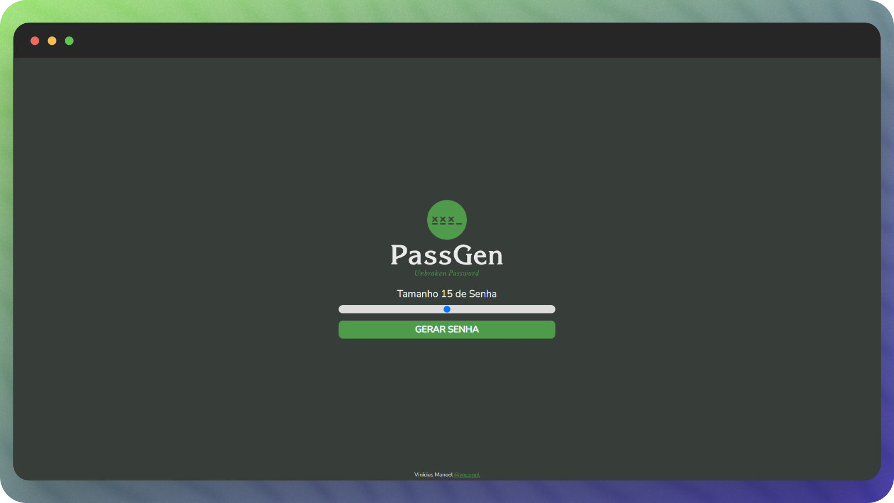

# Gerador de Senhas

Este é um simples gerador de senhas desenvolvido utilizando HTML, CSS e JavaScript. Ele permite que você crie senhas seguras com facilidade.

## Screenshots

## Como usar

1. Abra o arquivo `index.html` em seu navegador web.
2. Escolha o comprimento desejado para a senha utilizando a barra deslizante.
3. Caracteres (maiúsculas, minúsculas, números e símbolos).
4. Clique no botão "Gerar Senha" para criar uma senha segura.
5. A senha gerada será exibida na área designada. Você pode copiá-la para a área de transferência clicando no botão "Copiar Senha".

## Estrutura do Projeto

- **index.html**: Contém a estrutura HTML da página.
- **style.css**: Arquivo de estilo para a aparência da página.
- **script.js**: Código JavaScript responsável pela lógica do gerador de senhas.

## Personalização

Você pode personalizar o gerador de senhas de acordo com suas necessidades. Algumas sugestões incluem:

- Modificar o estilo visual no arquivo `style.css`.
- Adicionar mais opções de caracteres no arquivo `script.js`.
- Implementar funcionalidades adicionais, como a geração de múltiplas senhas.

## Contribuições

Contribuições são bem-vindas! Sinta-se à vontade para abrir problemas (issues) ou enviar solicitações de pull (pull requests) para melhorar este gerador de senhas.

## Licença

Este projeto é licenciado sob a [Licença MIT](LICENSE). Sinta-se livre para usar, modificar e distribuir conforme necessário.

<a href="#top">🔝 Volte para o topo</a>

